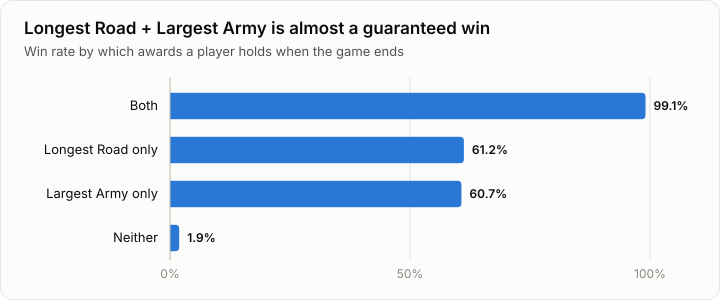
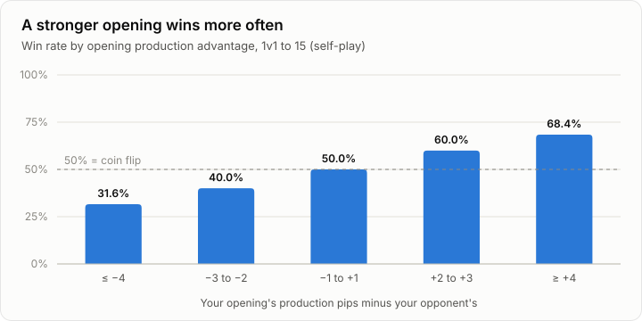
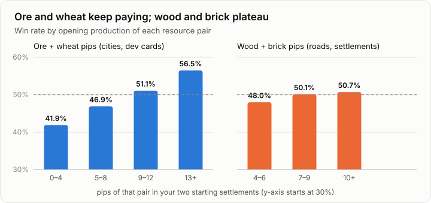
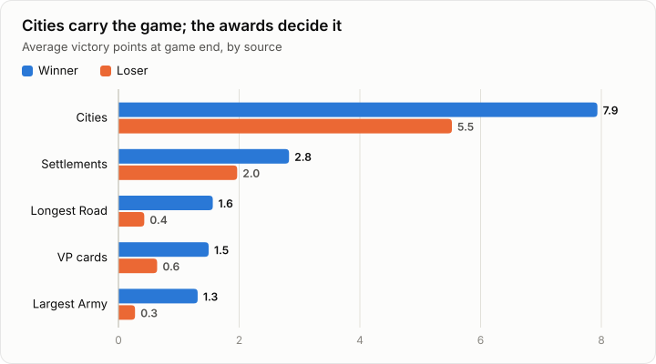
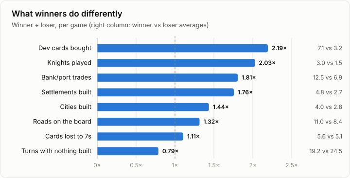
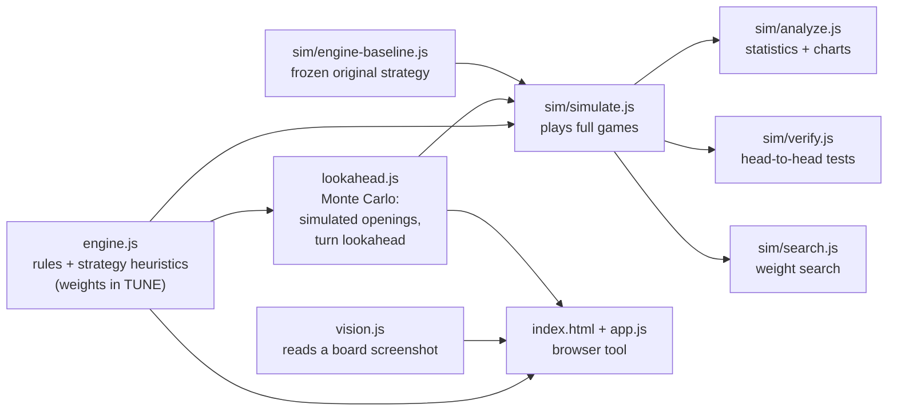
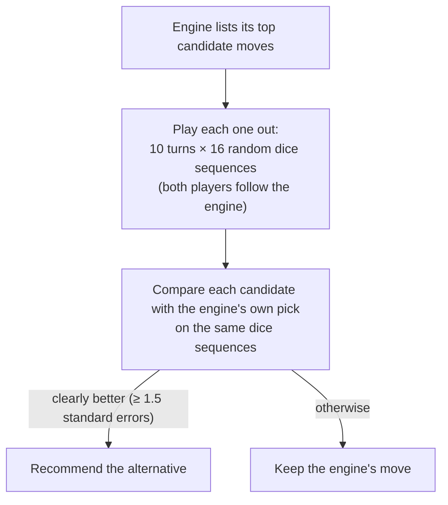
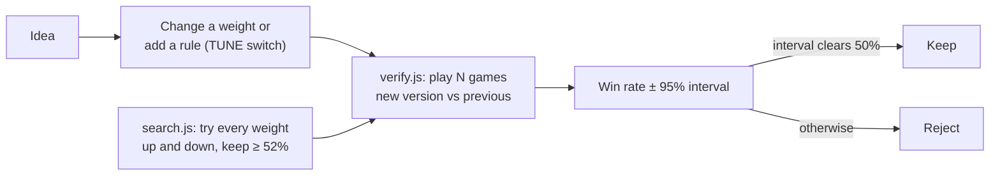
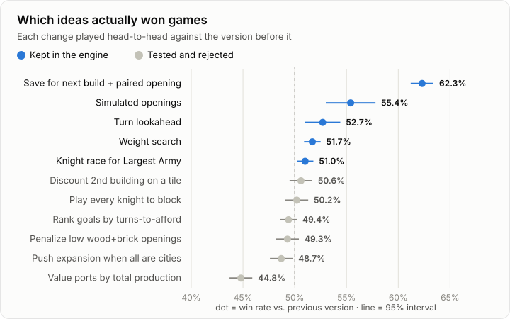
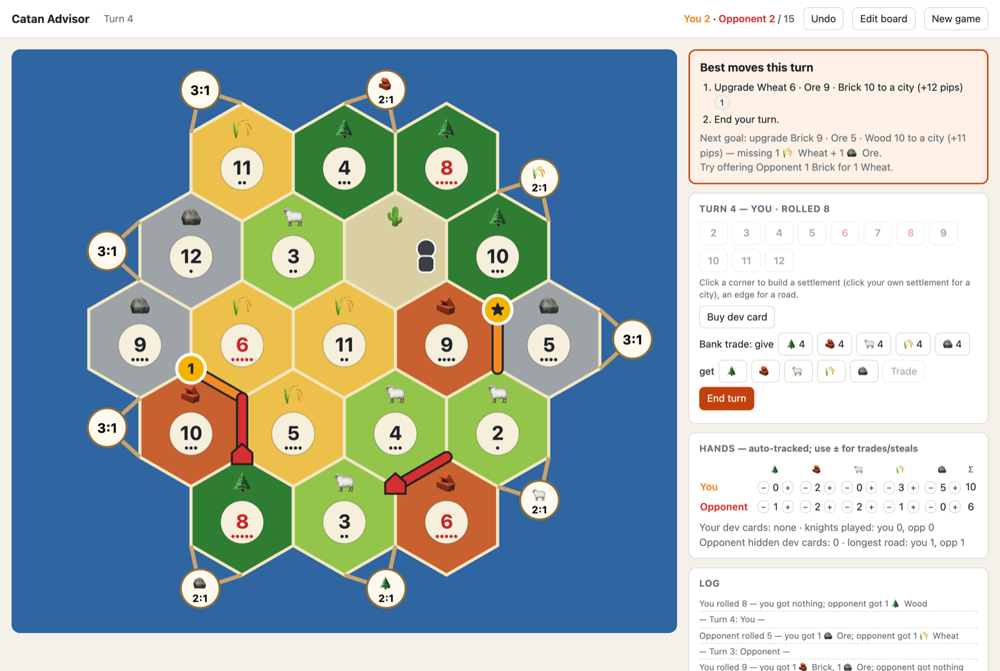

# catan-advisor

**What actually wins at Catan, measured over tens of thousands of simulated games.**

I built a Catan-playing bot, had it play itself, and measured what separates winners from losers. Then I tested strategy ideas head to head: each change played thousands of games against the version before it.

**TL;DR**
- **Hold Longest Road *and* Largest Army and you win 99% of 1v1 games.** Hold neither and you win 2%.
- **Your opening is worth a lot:** every pip of opening production over your opponent is worth about 4 points of win rate.
- **The biggest gain wasn't cleverness, it was patience:** saving cards for the next city or settlement instead of spending them on roads and dev cards. That change, together with a better opening score, beat the original strategy 62% of the time.

Everything reproduces with `node sim/analyze.js`: no dependencies, about 30 seconds on a laptop.

**▶ Try the advisor in your browser: [martha889.github.io/catan-advisor](https://martha889.github.io/catan-advisor/)**. Click **Try an example board** to see it in seconds; nothing to install.

<p align="center"></p>

**Contents:** [Catan in 60 seconds](#catan-in-60-seconds) · [Findings](#findings) · [How it works](#how-it-works) · [Experiments](#strategy-experiments) · [Try it](#try-it-against-a-bot) · [Reproduce](#reproduce-the-results) · [Limitations](#limitations) · [FAQ](#faq) · [Disclaimer](#disclaimer)

## Catan in 60 seconds

If you've never played *The Settlers of Catan*:

- **The board** is 19 hexagonal tiles. Each produces a resource (wood, brick, sheep, wheat or ore) and has a number from 2 to 12.
- **Production:** every turn someone rolls two dice, and every tile with that number pays its resource to each settlement touching it. A **city** gets double.
- **Pips** are the dots under each number: how many of the 36 two-dice combinations roll it. A 6 or 8 has 5 pips (rolled 5 times in 36); a 2 or 12 has 1. "More pips" means "produces more often".
- **Points (VP):**
  - Settlement = 1 point, city = 2.
  - **Longest Road** (5+ connected roads, longer than anyone else's) = 2 points.
  - **Largest Army** (3+ knight cards played, more than anyone else) = 2 points.
  - Both awards can be taken away. **Victory point cards**, bought as development cards, are worth 1 each.
- **The robber:** rolling a 7 lets you move it onto a tile, which then produces nothing, and steal a card. Anyone holding more cards than the **discard limit** loses half their hand.
- **Settlement names:** a settlement touches up to three tiles, so this README names spots by those tiles, e.g. **Ore 6 · Wheat 5 · Wood 11**.

This study uses **1v1 games to 15 points with a 9-card discard limit**, the common online two-player format, instead of the standard 4-player game to 10.

## Findings

Two kinds of evidence, labelled throughout:
- **Observed:** a pattern in 20,000 games of the engine playing itself. It's a correlation: it shows what winning positions look like, not what causes them.
- **Tested:** a head-to-head experiment, where a strategy change played thousands of games against the version without it. This is the evidence for cause and effect.

### 1. The two awards nearly decide the game *(observed)*

The awards are worth 4 points between them, more than a quarter of the 15 needed (chart above). Players who end the game holding neither almost never win. Holding just one is a 61% proposition.

### 2. The opening matters, and so does what you leave your opponent *(observed and tested)*

<p align="center"></p>

Each pip of opening production over your opponent is worth roughly 4 points of win rate. A 4+ pip edge wins 68%. When the engine chose its opening by playing whole games out from each candidate spot instead of using a formula, it won **55.4%** against the formula version *(tested)*.

<p align="center"></p>

The *kind* of production matters too. Ore and wheat (needed for cities and dev cards) keep paying the more you have. Wood and brick (roads and settlements) flatten out once you have a working amount. The engine almost never opens with fewer than 4 wood+brick pips, so that range isn't in the data.

**Case study.** I replayed the board from one recorded 1v1 game: the opponent's first settlement fixed, 500 games per candidate opening.

| Opening | Simulated win rate (± 95% interval) |
|---|---|
| Opening actually played: Ore 6 · Wheat 5 · Wood 11 + Sheep 8 · Wheat 4 · Brick 3 (one wood source) | 36.8% ± 4.2 |
| Best of 11 candidates: Wood 6 · Wheat 9 · Sheep 2 + Ore 6 · Wheat 4 · Brick 3 (all five resources) | 48.6% ± 4.4 |
| Worst: leaves the strong Ore 6 corner to the opponent | 2.6% ± 1.4 |

The "best" figure is the top of 11 noisy estimates, so expect it to be somewhat optimistic. The spread is real, though: the spots you leave your opponent can matter as much as the ones you take.

### 3. Cities carry the game *(observed)*

<p align="center"></p>

Cities provide over half of a winner's points. The typical winner uses all four city pieces. The roughly 6-point gap between winner and loser splits into about 2.4 from cities, 2.2 from the two awards, 0.9 from settlements and 0.9 from VP cards.

### 4. Winners build more, buy more dev cards and sit idle less *(observed)*

<p align="center"></p>

Winners buy about twice as many dev cards and play twice as many knights. They can afford to, because they produce more, so read this as "winners convert production into dev cards", not "buying dev cards makes you win". They also lose slightly more cards to 7s, since bigger production means bigger hands.

### 5. Going first is an advantage *(observed)*

The first player wins **57.6%** of games, and the second player 42.4%.

### What surprised me

- **Patience beat cleverness.** The biggest improvement came from *not* spending: holding cards for the next city or settlement.
- **Ports are overrated as building spots.** Valuing ports by all of your production made the engine *worse* (44.8% head to head). Valuing them only by surplus production was neutral. Port spots are usually coastal, with fewer tiles and less production, which is likely why.
- **More search didn't help.** A lookahead twice as deep (24 dice sequences, 12 turns) was no better than the lighter one.
- **Most "obvious" heuristics did nothing.** These all measured as neutral (see the chart below):
  - avoiding a second building on the same tile (robber risk)
  - an "endgame mode"
  - trading toward a goal whenever stuck

## How it works



**The engine** (`engine.js`) knows the rules and makes every decision with hand-written heuristics. Their weights live in one object, `TUNE`.
- **Opening:** scores your two starting spots as a pair. That's production with diminishing returns, plus bonuses for being able to build roads (wood and brick) and cities (ore and wheat).
- **Each turn:** lists every affordable action, meaning a settlement, a city, a road toward a target or a dev card, with any bank or port trades it needs. Each action gets a value in "weighted pips": expected production, adjusted for how scarce each resource is on this board. The engine takes the best action, repeating until nothing is worth doing. Trades are charged for, and so is anything that delays the nearest city or settlement.
- **Opponent awareness:**
  - defends Longest Road when the opponent could catch up, counting a possible Road Building card
  - values settlements that cut the opponent's road
  - races for Largest Army with knights
  - estimates the opponent's hidden VP cards
  - warns when a Monopoly card would hurt
- **Robber:** blocks the opponent's most productive tile and avoids your own.

**The lookahead** (`lookahead.js`) sits on top of the engine:



For the opening, it plays **whole games** out from each of the top six settlement spots, 60 games each, and picks the spot with the best simulated win rate.

## Strategy experiments

### Method



- **A game** is a full 1v1 game to 15 on a random standard board, with dice, robber, discards, dev cards, Longest Road and Largest Army. Bank and port trades are simulated; trades between players are not.
- **Seats alternate.** Each version plays both seats, and the first player alternates every game.
- **Randomness.** Both versions start from the same random seeds, so boards and dice match until their choices diverge. After that they differ, so results aren't paired game by game.
- **Margins:** ± is a 95% binomial interval. 16,000 games gives about ±0.8 points; 1,600 games gives about ±2.4.
- **Fresh seeds for confirmation.** The weight search used one set of seeds and the confirmation runs used different ones, so the confirmations are fresh tests.
- **Turn cap:** games stop at 400 turns. In the 20,000-game analysis none hit it.

### Results

<p align="center"></p>

Each row is measured against the version just before it, so gains don't simply add up.

**Kept:**

| Change | Win rate vs. previous | Games |
|---|---|---|
| Save cards for the nearest city/settlement; score both opening spots as a pair; value roads less | 62.3% ± 1.1 (vs. the original) | 8,000 |
| Weight search: a victory point worth less relative to production; costlier bank trades | 51.7% ± 0.8 | 16,000 |
| Turn lookahead (4 candidates, 16 dice sequences, 10 turns) | 52.7% ± 1.7 | 3,200 |
| Simulated openings (6 spots × 60 games) | 55.4% ± 2.4 | 1,600 |
| Play knights to race for Largest Army whenever it's winnable | 51.0% ± 0.8 | 16,000 |
| Value 2:1 ports by surplus production | +0.1 (neutral; kept so port advice reflects your surplus) | 16,000 |

**Rejected:**

| Idea | Win rate vs. previous | Games |
|---|---|---|
| Value ports by total production | 44.8% ± 1.1 | 8,000 |
| Value ports by surplus production, at a high weight | 31.1% ± 1.0 | 8,000 |
| Trade toward a goal whenever nothing is buildable | turning it off: 60.3% → 63.7% vs. the original | 2,000 each |
| Push for expansion once every settlement is a city | 48.7% ± 1.1 | 8,000 |
| Penalize openings with little wood and brick | 49.3% ± 1.1 | 8,000 |
| Rank goals by estimated turns to afford them | 49.4% ± 0.8 | 16,000 |
| "Endgame mode": count production for less near the target | 48.8–49.9% ± 1.8 | 3,000 |
| Play every knight just to block the opponent | 50.2% ± 1.1 | 8,000 |
| Discount a second building on the same tile (robber risk) | 50.6% ± 1.1 | 8,000 |
| Account for the best spot your opening leaves the opponent | 51.0–51.3% ± 1.1 (borderline) | 8,000 |
| Deeper lookahead (24 sequences, 12 turns) | 52.1% ± 2.4, no better than the lighter one | 1,600 |

"Neutral" means the 95% interval includes 50%.

<details>
<summary><b>Full data tables</b> (20,000 self-play games, seed 500000)</summary>

| Measure | Value |
|---|---|
| Game length (turns, both players) | median 73, middle 80%: 57–92 |
| First player wins | 57.6% |
| Unfinished games (400-turn cap) | 0 |
| Loser's final score | 8.8 VP on average |

| Points by source | Winner | Loser |
|---|---|---|
| Settlements | 2.83 | 1.97 |
| Cities (2 each) | 7.93 | 5.52 |
| Longest Road (2) | 1.56 | 0.43 |
| Largest Army (2) | 1.31 | 0.27 |
| VP cards | 1.49 | 0.64 |

| Holding at the end | Players | Win rate |
|---|---|---|
| Both | 9,093 | 99.1% |
| Longest Road only | 10,817 | 61.2% |
| Largest Army only | 6,776 | 60.7% |
| Neither | 13,314 | 1.9% |

| Per game | Winner | Loser |
|---|---|---|
| Settlements built | 4.79 | 2.73 |
| Cities built | 3.97 | 2.76 |
| Roads on the board | 11.0 | 8.4 |
| Dev cards bought | 7.05 | 3.21 |
| Knights played | 3.04 | 1.50 |
| Bank/port trades | 12.5 | 6.9 |
| Cards lost to 7s | 5.6 | 5.1 |
| Turns with nothing built | 19.2 | 24.5 |

| Opening pip advantage | Players | Win rate |
|---|---|---|
| ≤ −4 | 3,080 | 31.6% |
| −3 to −2 | 7,639 | 40.0% |
| −1 to +1 | 18,562 | 50.0% |
| +2 to +3 | 7,639 | 60.0% |
| ≥ +4 | 3,080 | 68.4% |

| Opening ore + wheat pips | Players | Win rate |
|---|---|---|
| 0–4 | 401 | 41.9% |
| 5–8 | 15,483 | 46.9% |
| 9–12 | 19,434 | 51.1% |
| 13+ | 4,682 | 56.5% |

| Opening wood + brick pips | Players | Win rate |
|---|---|---|
| 0–3 | 3 | — |
| 4–6 | 6,161 | 48.0% |
| 7–9 | 19,699 | 50.1% |
| 10+ | 14,137 | 50.7% |

Openings covering 4 of the 5 resources won 50.5% and those covering all 5 won 49.9%, so variety alone made no difference. Starting on a port: 2:1 47.2%, 3:1 47.6%, no port 50.1%.

</details>

## Try it against a bot

The repo includes a browser tool for **1v1 games against a bot**: you record the game, it suggests your moves. It runs entirely in your browser, with nothing to install and no account.

<p align="center"></p>

1. **Open it.** Use the [live version](https://martha889.github.io/catan-advisor/), or clone the repo and open `index.html` in Chrome, Safari or Firefox.
2. **Load the board.** Or click **Try an example board** to skip this step.
   - **From a screenshot:** take one of the board (on macOS, ⌘⇧⌃4 copies it) and press ⌘V on the page. Then click the number token on the **top-left** tile, then the **bottom-right** tile. The reader is tuned to colonist.io's board art, one of the places you can play against bots; with other art, expect to fix more tiles by hand.
   - **By hand:** click each tile to set its resource and number.
3. **Check the board.** Tiles with a dashed outline were uncertain; click to fix them. Click a port to change its type.
4. **Settings.** Choose who places first, the points to win and the discard limit, then press **Start game**.
5. **Record the game as it happens.**
   - **Setup:** corners are settlements and edges are roads, for both players.
   - **Each turn:** enter the dice roll with the number buttons.
   - **Builds:** click your own settlement to upgrade it to a city.
   - **Robber, steals, dev cards and bank trades** have their own buttons; the ± buttons cover anything else.
   - **Undo** (⌘Z) reverts a misclick. Progress is saved in your browser.
6. **Read the advice.** The orange panel gives your setup spots, build order (including trades), robber placement, discards and dev card plays. Gold markers show them on the board.

The tool runs the full engine in your browser:
- **Setup:** it plays 60 whole games from each of the six best spots (about 5–10 seconds, with a progress line) and ranks them by simulated win rate, with the engine playing your opponent.
- **Your turn:** it runs the turn lookahead, which takes well under a second. When the lookahead disagrees with the simple rule, the panel says so and by roughly how much.

## Reproduce the results

Requires Node.js 18 or later. There are no dependencies.

```sh
git clone https://github.com/martha889/catan-advisor && cd catan-advisor

# Self-play statistics, then the charts (≈30 s on 16 cores)
node sim/analyze.js 20000 500000 --json docs/analysis.json
node docs/make-charts.js

# Head-to-head: the current engine (B) vs the frozen original strategy (A)
node sim/simulate.js 2000 7

# The current engine vs itself with one weight changed
node sim/simulate.js 2000 7 --vs current spendReserve=10

# Large parallel check, with turn lookahead and simulated openings switched on
node sim/verify.js 1600 990000 lookahead=4,16,10 opening=6,60

# Try every weight up and down; keep changes that win ≥ 52%
node sim/search.js 3200 2
```

`verify.js` also accepts `A_TUNE='{"knightEager":6}'` to test against a different opponent style. Results vary slightly with the seed.

## Limitations

- **Self-play only.** The engine played itself and its earlier versions. Its strength against people hasn't been measured, and findings about *its* games may not carry over to human play.
- **No trades between players**, which matter a lot in real Catan. Only bank and port trades are modelled.
- **1v1 base game only:** standard random boards, no expansions, no 3–6 player games.
- **Some hidden information leaks.** When playing a Monopoly card, the simulated engine can see the opponent's actual hand.
- **Heuristic, not optimal.** The engine is hand-written rules plus Monte Carlo search, not a solved strategy. "What wins" here means "what wins for this kind of player".

## FAQ

**Why not reinforcement learning or AlphaZero?** This started as a practical advisor, and hand-written heuristics are easy to inspect and explain. A learned policy would very likely play better. The simulator is a ready-made environment for anyone who wants to try (see [Contributing](#contributing)).

**How strong is it against people?** Unknown. It hasn't been measured. Self-play results say which version of the engine is stronger, not how it compares to humans.

**Why 1v1 to 15?** It's a common online two-player format, and two players keep the simulation clean. Most of the engine already supports more players; the simulator doesn't yet.

**Why no player-to-player trading?** Trading needs a model of how the other player decides what to accept. That's a project in its own right, so it was left out to keep the results honest.

**Can I use this while playing people online?** No. That's unfair to your opponents and against the rules of online platforms. The tool is for studying strategy, reviewing your own finished games and playing bots. It doesn't connect to any game platform; you enter moves by hand.

## Roadmap

- Support 3–4 player games in the simulator.
- Model player-to-player trades.
- Test against stronger opponents: a learned policy, or a library of human openings.

## Contributing

Ideas are cheap to test.
1. **Add a switch** for your idea in `TUNE` (`engine.js`), defaulting to off.
2. **Test it head to head:** `node sim/verify.js 16000 900000 yourSwitch=true` runs the game simulations in parallel and prints the win rate with its interval.
3. **Open a pull request** with the result, whether it helped or not. Negative results are welcome; this README lists eleven of them.

## Citation

```bibtex
@software{choudhary2026catanadvisor,
  author = {Choudhary, Sarthak},
  title  = {catan-advisor: measuring what wins at Catan through self-play},
  year   = {2026},
  url    = {https://github.com/martha889/catan-advisor}
}
```

## Disclaimer

This project is provided for educational and research purposes only, "as is", without warranty of any kind; see [LICENSE](LICENSE). The author is not responsible for how it is used.

- Use it for studying strategy, reviewing your own completed games, or games against bots. Do not use it to get live assistance in games against other people. That is unfair to your opponents and breaks the rules of most online platforms.
- You are responsible for complying with the terms of service of any platform you play on.
- *CATAN* and *The Settlers of Catan* are trademarks of Catan GmbH. This project is not affiliated with, endorsed by or sponsored by Catan GmbH, CATAN Studio, colonist.io or any other publisher or platform. Game names are used only to describe what the software studies.
